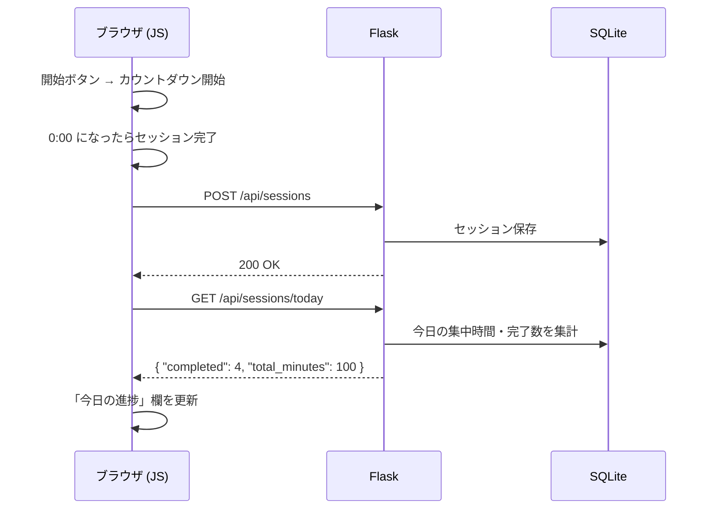

# ポモドーロタイマー Webアプリケーション アーキテクチャ案

## 概要

Flask + HTML/CSS/JavaScript で構築するポモドーロタイマー Web アプリケーションの設計方針。  
ユニットテストのしやすさを考慮し、責務の明確な分離と依存注入（DI）を採用する。

---

## ディレクトリ構成

```
1.pomodoro/
├── app.py                   # create_app() のみ（App Factory パターン）
├── config.py                # 環境別設定（本番 / テスト）
├── models.py                # SQLAlchemy モデル定義
├── repositories.py          # DB アクセス抽象化
├── services.py              # ビジネスロジック
├── requirements.txt         # 依存パッケージ
├── static/
│   ├── css/
│   │   └── style.css        # 紫系カラーテーマ
│   └── js/
│       ├── timer.js         # PomodoroTimer クラス（タイマーロジック）
│       ├── renderer.js      # CircleRenderer クラス（SVG描画）
│       └── api.js           # ApiClient クラス（Flask API 通信）
├── templates/
│   └── index.html           # メインページ
└── tests/
    ├── conftest.py          # pytest フィクスチャ（app, client, db）
    ├── test_services.py     # ビジネスロジックのテスト（モック使用）
    ├── test_repositories.py # DB 操作のテスト（インメモリ SQLite）
    └── test_routes.py       # HTTP エンドポイントのテスト（Flask test client）
```

---

## バックエンド設計

### レイヤー構成

```
[ Flask Routes (app.py) ]
        ↓ 呼び出し
[ Service Layer (services.py) ]   ← ビジネスロジックの中心
        ↓ 依存注入（DI）
[ Repository Layer (repositories.py) ]
        ↓
[ SQLite (models.py / SQLAlchemy) ]
```

### API エンドポイント

| エンドポイント         | メソッド | 役割                                   |
|----------------------|--------|--------------------------------------|
| `/`                  | GET    | メインページを返す                      |
| `/api/sessions`      | POST   | セッション完了を記録                    |
| `/api/sessions/today`| GET    | 今日の進捗（完了数・集中時間）を返す     |

### データモデル

```python
# models.py
class Session(db.Model):
    id           # 主キー
    completed_at # 完了日時
    duration     # 集中時間（分）
```

### サービス層（ビジネスロジック）

```python
# services.py
class PomodoroService:
    def __init__(self, repo):          # 依存注入（DI）でテスト時にモック差し替え可能
        self.repo = repo

    def complete_session(self, duration: int) -> dict:
        if duration <= 0:
            raise ValueError("duration must be positive")
        return self.repo.save_session(duration)

    def get_today_stats(self) -> dict:
        sessions = self.repo.find_today_sessions()
        return {
            "completed": len(sessions),
            "total_minutes": sum(s.duration for s in sessions)
        }
```

### 設定管理（App Factory パターン）

```python
# config.py
class Config:
    SQLALCHEMY_DATABASE_URI = "sqlite:///pomodoro.db"

class TestConfig(Config):
    TESTING = True
    SQLALCHEMY_DATABASE_URI = "sqlite:///:memory:"  # テストはインメモリ DB

# app.py
def create_app(config=None):
    app = Flask(__name__)
    app.config.from_object(config or Config)
    ...
    return app
```

---

## フロントエンド設計

### クラス構成

| クラス           | ファイル       | 責務                                           |
|----------------|-------------|----------------------------------------------|
| `PomodoroTimer`  | `timer.js`  | カウントダウンロジック・フェーズ管理（ブラウザAPIに非依存） |
| `CircleRenderer` | `renderer.js`| SVG 円形プログレスバーの描画                    |
| `ApiClient`      | `api.js`    | Flask API との通信（fetch）                    |

### 円形プログレスバー

SVG の `stroke-dashoffset` アニメーションで実装する。

$$
\text{circumference} = 2\pi r
$$
$$
\text{offset} = \text{circumference} \times \frac{\text{残り時間}}{\text{総時間}}
$$

### データフロー



---

## フェーズ管理

```
作業 (25分) → 短い休憩 (5分) → 作業 (25分) → 短い休憩 (5分)
                                                        ↓ 4ポモドーロごと
                                                   長い休憩 (15分)
```

---

## テスト戦略

| テスト種別          | 対象ファイル              | 手法                          |
|------------------|------------------------|------------------------------|
| ビジネスロジック    | `test_services.py`     | `unittest.mock` でリポジトリをモック |
| DB 操作           | `test_repositories.py` | インメモリ SQLite (`TestConfig`) |
| HTTP エンドポイント | `test_routes.py`       | Flask test client             |
| フロントエンド     | （Jest 等）             | `PomodoroTimer` はブラウザ非依存のため JSDOM 不要 |

---

## 採用技術

| 区分         | 技術                          |
|------------|------------------------------|
| バックエンド  | Python / Flask               |
| ORM        | SQLAlchemy                   |
| DB         | SQLite                       |
| フロントエンド | HTML / CSS / Vanilla JS      |
| テスト       | pytest / unittest.mock       |
