# ポモドーロタイマー 段階的実装計画

## Phase 1 — バックエンド基盤（土台づくり）

**目標：** Flask が起動し、DB への読み書きができる状態

- [ ] `requirements.txt` の作成
- [ ] `config.py` — `Config` / `TestConfig` の定義
- [ ] `models.py` — `Session` モデルの定義
- [ ] `app.py` — `create_app()` の実装（DB 初期化含む）

**確認方法：** `flask run` でサーバーが起動すること

---

## Phase 2 — バックエンド API（データ層 → サービス層 → ルート層の順）

**目標：** curl / Postman で API が正常レスポンスを返す状態

- [ ] `repositories.py` — `save_session()` / `find_today_sessions()` の実装
- [ ] `services.py` — `PomodoroService` の実装（バリデーション・集計ロジック）
- [ ] `app.py` にルート追加（`GET /`、`POST /api/sessions`、`GET /api/sessions/today`）

**確認方法：**
```bash
curl -X POST http://localhost:5000/api/sessions -H "Content-Type: application/json" -d '{"duration": 25}'
curl http://localhost:5000/api/sessions/today
```

---

## Phase 3 — フロントエンド骨格（HTML + CSS）

**目標：** モック画像に近い静的な見た目が完成した状態

- [x] `templates/index.html` — SVG・ボタン・進捗セクションの HTML 構造
- [x] `static/css/style.css` — 紫系カラーテーマ・レイアウト・ボタンスタイル

**確認方法：** ブラウザで開き、モックと外観が一致すること

---

## Phase 4 — タイマーロジック（フロントエンドコア）

**目標：** タイマーが画面上で動作する状態（API 連携なしでも可）

- [ ] `static/js/timer.js` — `PomodoroTimer` クラスの実装
  - カウントダウン・開始/一時停止・リセット
  - フェーズ遷移（作業 → 短い休憩 → … → 長い休憩）
- [ ] `static/js/renderer.js` — `CircleRenderer` クラスの実装
  - SVG `stroke-dashoffset` による進捗描画・リアルタイム更新

**確認方法：** ブラウザでタイマーが動き、円形プログレスバーが減っていくこと

---

## Phase 5 — API 連携（フロントエンドとバックエンドの接続）

**目標：** セッション完了が記録され、「今日の進捗」が更新される状態（= アプリ完成）

- [ ] `static/js/api.js` — `ApiClient` クラスの実装
- [ ] `timer.js` にセッション完了フックを追加（`onComplete` コールバックで API 呼び出し）
- [ ] ページ読み込み時に `GET /api/sessions/today` を呼び出して進捗を初期表示

**確認方法：** 25分タイマー完了後、完了数と集中時間が増加すること

---

## Phase 6 — テスト実装

**目標：** `pytest` が全テスト通過する状態

- [x] `tests/conftest.py` — フィクスチャの定義（app, client, インメモリ DB）
- [x] `tests/test_services.py` — `PomodoroService` のモックテスト
- [x] `tests/test_repositories.py` — リポジトリの DB 操作テスト
- [x] `tests/test_routes.py` — エンドポイントのテスト

**確認方法：** `pytest tests/ -v` が全 PASSED

---

## フェーズ全体図

```mermaid
gantt
    dateFormat  X
    axisFormat Phase %s
    section バックエンド
    Phase 1 基盤          :p1, 0, 1
    Phase 2 API           :p2, after p1, 1
    section フロントエンド
    Phase 3 HTML/CSS      :p3, after p1, 1
    Phase 4 タイマーロジック :p4, after p3, 1
    Phase 5 API連携        :p5, after p2, 1
    section テスト
    Phase 6 テスト実装     :p6, after p5, 1
```



---

## 実装の考え方

| 考え方 | 理由 |
|---|---|
| データ層 → サービス層 → ルート層の順 | 依存関係の方向に沿って実装することで手戻りが少ない |
| Phase 3（CSS）は Phase 2 と並行可能 | バックエンドに依存しないため |
| Phase 4 はブラウザだけで完結する | API なしでもタイマー動作確認ができ、デバッグしやすい |
| テストは最後にまとめて実装 | 各層の実装が固まってからテストを書くことで仕様変更の影響を最小化 |
